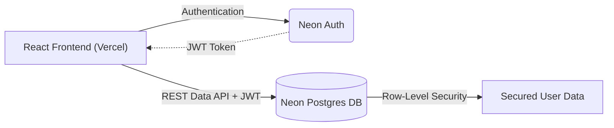
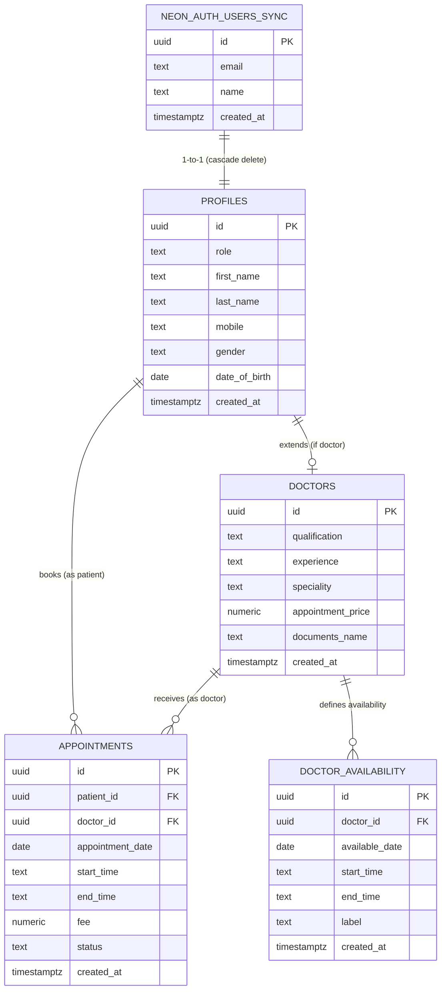
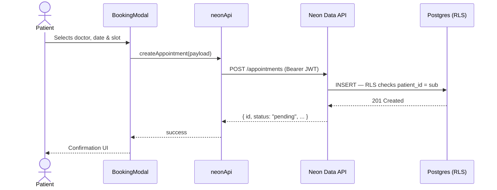

<div align="center">
  
  <h1>Slotly - Patient Appointment Booking System</h1>
  <p><strong>Assessment 2 Submission for JaypeeBrothers Medical Publishers Pvt. Ltd.</strong></p>
  <p>A modern, sleek, and high-performance appointment booking platform for doctors and patients.</p>
  
  <br />
  <p>
    <a href="https://slotlly.vercel.app/"><strong>🌍 Live Demo (Vercel)</strong></a> •
    <a href="https://github.com/URAYUSHJAIN/Slotly"><strong>💻 GitHub Repository</strong></a>
  </p>
</div>

---

## 📖 Instructions to Use

### For Patients
1. Go to the [Live Demo](https://slotlly.vercel.app/).
2. Click on the **Patient Login** tab, then click **Signup** at the bottom to create a new account.
3. Browse the directory of doctors, search by specialty, and book an available time slot.
4. View your upcoming bookings on your dedicated Patient Dashboard.

### For Doctors
1. Go to the [Live Demo](https://slotlly.vercel.app/).
2. Click on the **Doctor Login** tab, then click **Signup** at the bottom to create a doctor profile (requires details like Speciality, Experience, and Price).
3. Once logged in, use the **Schedule** tab to set your working hours and availability blocks.
4. View your daily schedule and manage incoming patient appointments on the Doctor Dashboard.

---

## 🔑 Test Credentials

> You can **login / signup** directly using the pre-seeded accounts below — no registration required!

### 🧑‍⚕️ Patient Account
| Field        | Value                       |
|--------------|-----------------------------|
| **Name**     | Aarav Kapoor                |
| **Email**    | aarav.kapoor@vercel.app     |
| **Password** | patient@123                 |

### 👨‍⚕️ Doctor Account
| Field        | Value                       |
|--------------|-----------------------------|
| **Name**     | Anjali Sharma               |
| **Email**    | anjali.sharma@vercel.app    |
| **Password** | doctor@123                  |

---

## 📌 Problem Statement
Many small clinics and healthcare centers still manage patient appointments manually through phone calls or registers. This often leads to scheduling conflicts, missed appointments, and poor record management. Build a web-based appointment booking platform where patients can book appointments with doctors and clinics can manage schedules efficiently. The platform should provide a simple and organized appointment management workflow.

## ✅ User Stories Checklist

### As a Patient
- [x] I should be able to create an account and log in.
- [x] I should be able to browse available doctors.
- [x] I should be able to book appointments.
- [x] I should be able to view my appointment history.

### As an Admin/Doctor
- [x] I should be able to manage appointment slots.
- [x] I should be able to approve or reject appointments.
- [x] I should be able to view daily schedules.

## 🏗️ Core Features
- **Authentication**: Secure email/password login using Neon Auth (Better Auth). No passwords stored in our database.
- **Doctor Listing**: Dynamic search and filtering of specialists across `BrowseDoctorsPage`.
- **Appointment Booking**: Real-time slot reservation with fee, start time, and end time captured via `BookingModal`.
- **Availability Management**: Doctors define date-specific availability blocks in `DoctorSchedule`.
- **Dashboard**: Role-based isolated dashboards for both patients and doctors.
- **Status Workflow**: Appointments flow through `pending → upcoming → completed` or `rejected / cancelled`.

---

## 🏛️ High-Level Design (HLD)

The system follows a modern decoupled Client-Serverless architecture:



| Layer | Technology | Responsibility |
|---|---|---|
| **Frontend** | React 18 + Vite, deployed on Vercel | Routing, UI state, role-based views |
| **Identity** | Neon Auth (Better Auth) | Signup, login, JWT generation & session management |
| **Data API** | Neon Data API (PostgREST) | RESTful DB interface, JWT validation, grant enforcement |
| **Database** | Neon Serverless Postgres | Data storage, Row-Level Security, schema |

### Key Design Decisions
1. **No custom backend server** — The React client calls Neon's Data API directly using Bearer JWTs, eliminating a traditional Express/Node middleware layer.
2. **Security at the DB level** — RLS policies on every table ensure users can only read/write their own rows, even if the frontend sends a malformed request.
3. **Role-based access** — A `role` field on `profiles` (`'patient'` | `'doctor'`) drives all conditional UI rendering and DB policy enforcement.

---

## ⚙️ Low-Level Design (LLD)

### Database Schema (Entity Relationship)



#### Table Details

- **`neon_auth.users_sync`** *(read-only mirror, managed by Neon Auth)*
  - Provisioned automatically when Neon Auth is enabled. Contains `id`, `email`, `name`.

- **`profiles`** — Base user data, one row per auth user.
  - `id` (UUID, PK — FK to `neon_auth.users_sync.id`, cascade delete)
  - `role` — `'patient'` or `'doctor'`
  - `first_name`, `last_name`, `mobile`, `gender`, `date_of_birth`

- **`doctors`** — Doctor-specific extension, only for `role = 'doctor'` profiles.
  - `id` (UUID, PK + FK to `profiles.id`, cascade delete)
  - `qualification`, `experience`, `speciality`, `appointment_price`, `documents_name`

- **`appointments`** — Booking records linking patients to doctors.
  - `id` (UUID, PK — auto-generated)
  - `patient_id` / `doctor_id` (FK to `profiles` / `doctors`)
  - `appointment_date` (Date), `start_time`, `end_time` (text HH:MM), `fee` (numeric)
  - `status` — `pending` → `upcoming` → `completed` | `cancelled` | `rejected`

- **`doctor_availability`** — Date-specific availability blocks set by doctors.
  - `id` (UUID, PK — auto-generated)
  - `doctor_id` (FK to `doctors.id`, cascade delete)
  - `available_date` (Date), `start_time`, `end_time`, `label`

#### Row-Level Security Summary

| Table | Policy | Rule |
|---|---|---|
| `profiles` | read own | `id = current_user_id()` |
| `profiles` | read doctors (public) | `role = 'doctor'` |
| `profiles` | insert / update own | `id = current_user_id()` |
| `doctors` | read all | `true` (any authenticated user) |
| `doctors` | insert / update own | `id = current_user_id()` |
| `appointments` | read (patient) | `patient_id = current_user_id()` |
| `appointments` | read (doctor) | `doctor_id = current_user_id()` |
| `appointments` | insert | `patient_id = current_user_id()` |
| `appointments` | update (doctor) | `doctor_id = current_user_id()` |
| `appointments` | update (patient) | `patient_id = current_user_id()` |
| `doctor_availability` | read all | `true` |
| `doctor_availability` | insert / delete own | `doctor_id = current_user_id()` |

---

### Frontend Structure

```
client/src/
├── main.jsx                    # App entry point, auth provider setup
├── App.jsx                     # Core routing & layout wrapper
├── index.css                   # Global design system & glassmorphism styles
│
├── pages/
│   ├── AuthPage.jsx            # Dual-role (Patient/Doctor) login & signup
│   ├── BrowseDoctorsPage.jsx   # Search, filter, and list available doctors
│   ├── AppointmentsPage.jsx    # Role-based dashboard router
│   ├── PatientsPage.jsx        # Patient-facing marketing / info page
│   ├── AboutPage.jsx           # About Slotly page
│   ├── FeaturesPage.jsx        # Feature highlights page
│   ├── HowItWorksPage.jsx      # Step-by-step explainer
│   ├── PricingPage.jsx         # Pricing tiers page
│   ├── SupportPage.jsx         # Support & contact page
│   ├── PrivacyPage.jsx         # Privacy policy
│   ├── TermsPage.jsx           # Terms of service
│   └── appointments/
│       ├── PatientAppointments.jsx  # Patient: view history & upcoming bookings
│       ├── DoctorDashboard.jsx      # Doctor: view & manage daily schedules
│       └── DoctorSchedule.jsx       # Doctor: set availability blocks
│
├── components/
│   ├── Navbar.jsx              # Responsive navigation bar
│   ├── Hero.jsx                # Landing hero section
│   ├── BookingModal.jsx        # Appointment booking dialog (slot picker + fee)
│   ├── SearchBar.jsx           # Doctor search & specialty filter
│   ├── Viz.jsx                 # Data visualisation component
│   ├── Badge.jsx               # Status / role badge
│   ├── Button.jsx              # Reusable styled button
│   ├── Card.jsx                # Generic card container
│   ├── ServiceCard.jsx         # Service feature card
│   └── StatCard.jsx            # Statistics display card
│
└── lib/
    ├── neonApi.js              # All Neon Data API REST calls (appointments, doctors, availability)
    ├── authActions.js          # Sign-up, sign-in, sign-out via Neon Auth
    ├── auth.js                 # Auth client configuration
    ├── useAuth.jsx             # React hook — current user + JWT access
    └── healthCheck.js          # API connectivity health check
```

### API Flow — Booking an Appointment



---

## ✨ Design & Tech Highlights
- **Stunning User Interface**: Highly polished glassmorphism-inspired UI with smooth micro-interactions.
- **No-Backend Architecture**: Neon Data API (PostgREST) queried directly from the React frontend — no Express/Node server needed.
- **Security-first**: Row-Level Security enforced at the Postgres level for every table.
- **Role-based UX**: Single auth flow that branches into distinct Patient and Doctor experiences.

## 🚀 Future Roadmap
- **WhatsApp Notifications via Twilio**: Real-time appointment reminders, confirmations, and cancellation alerts.
- **Payment Gateway Integration**: Stripe for consultation fees at the time of booking.
- **Video Consultations**: WebRTC or Zoom API for seamless remote telehealth appointments.

---

<div align="center">
  <p><i>Created by <b>urayushjain</b></i></p>
</div>
