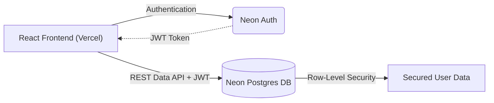
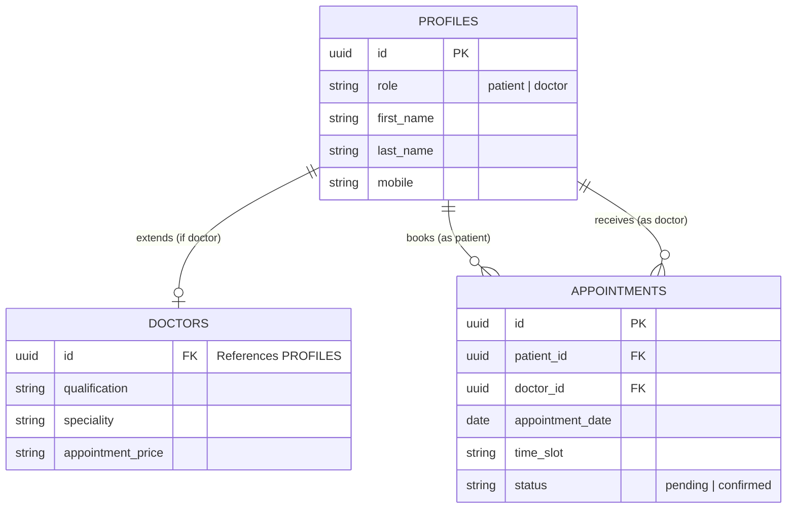

  
  <h1>Slotly - Patient Appointment Booking System</h1>
  
<strong>Assessment 2 Submission for JaypeeBrothers Medical Publishers Pvt. Ltd.</strong>

  
A modern, sleek, and high-performance appointment booking platform for doctors and patients.

  
   
  

    <a href="https://slotlly.vercel.app/"><strong>🌍 Live Demo (Vercel)</strong></a> •
    <a href="https://github.com/URAYUSHJAIN/Slotly"><strong>💻 GitHub Repository</strong></a>
  

---

## 📖 Instructions to Use

### For Patients
1. Go to the [Live Demo](https://slotlly.vercel.app/).
2. Click on the **Patient Login** tab, then click **Signup** at the bottom to create a new account.
3. Browse the directory of doctors, search by specialty, and book an available time slot.
4. View your upcoming bookings on your dedicated Patient Dashboard.

### For Doctors
1. Go to the [Live Demo](https://slotlly.vercel.app/).
2. Click on the **Doctor Login** tab, then click **Signup** at the bottom to create a doctor profile (requires details like Speciality, Experience, and Price).
3. Once logged in, use the **Schedule** tab to set your working hours and consultation duration.
4. View your daily schedule and manage incoming patient appointments on the Doctor Dashboard.

---

## 📌 Problem Statement
Many small clinics and healthcare centers still manage patient appointments manually through phone calls or registers. This often leads to scheduling conflicts, missed appointments, and poor record management. Build a web-based appointment booking platform where patients can book appointments with doctors and clinics can manage schedules efficiently. The platform should provide a simple and organized appointment management workflow.

## ✅ User Stories Checklist

### As a Patient
- [x] I should be able to create an account and log in.
- [x] I should be able to browse available doctors.
- [x] I should be able to book appointments.
- [x] I should be able to view my appointment history.

### As an Admin/Doctor
- [x] I should be able to manage appointment slots.
- [x] I should be able to approve or reject appointments.
- [x] I should be able to view daily schedules.

## 🏗️ Core Features
- **Authentication**: Secure email/password login using Neon Auth.
- **Doctor Listing**: Dynamic search and filtering of specialists.
- **Appointment Booking**: Real-time slot reservation system.
- **Schedule Management**: Doctors can define their availability and consultation slot duration.
- **Dashboard**: Role-based isolated dashboards for both patients and doctors.

---

## 🏛️ High-Level Design (HLD)

The system follows a modern decoupled Client-Serverless architecture:

1. **Frontend (Client)**: Built with **React** and **Vite**. Deployed on **Vercel**. Handles routing, UI state, and role-based views.
2. **Authentication (Identity)**: Managed by **Neon Auth (Better Auth)**. Handles secure sign-ups, JWT generation, and session management.
3. **Backend / Database (Data Layer)**: Powered by **Neon Serverless Postgres** via the **Neon Data API**. Exposes a RESTful interface to directly query the database from the client using secure JWT validation.
4. **Security Layer**: Row-Level Security (RLS) is enforced directly at the Postgres database level, ensuring users can only read/write their own appointments and profiles based on their JWT `sub` claim.

---

## ⚙️ Low-Level Design (LLD)

### Database Schema (Entity Relationship)

- **`profiles`**: Stores base user data. (1-to-1 mapping with Auth).
  - `id` (UUID, Primary Key)
  - `role` ('patient' or 'doctor')
  - `first_name`, `last_name`, `mobile`, `gender`, `date_of_birth`

- **`doctors`**: Extension table for doctor-specific metadata.
  - `id` (UUID, Foreign Key to `profiles.id`)
  - `qualification`, `experience`, `speciality`, `appointment_price`

- **`appointments`**: Tracks bookings between patients and doctors.
  - `id` (UUID, Primary Key)
  - `patient_id` (UUID, FK to `profiles`)
  - `doctor_id` (UUID, FK to `profiles`)
  - `appointment_date` (Date)
  - `time_slot` (String)
  - `status` ('pending', 'confirmed', 'cancelled', 'completed')

### Frontend Component Structure

- `App.jsx` - Core routing and layout wrapper.
- `/pages`
  - `LandingPage.jsx` - Hero sections, marketing copy.
  - `AuthPage.jsx` - Handles dual-role (Patient/Doctor) login and signup.
  - `DoctorsPage.jsx` - Search, filter, and list available doctors.
  - `AppointmentsPage.jsx` - Role-based dashboard router.
    - `PatientAppointments.jsx` - View history and upcoming bookings.
    - `DoctorDashboard.jsx` - View and manage daily schedules.
    - `DoctorSchedule.jsx` - Manage availability slots.
- `/lib`
  - `neonApi.js` - Wrapper for all direct Data API REST calls.

---

## ✨ Design & Tech Highlights
- **Stunning User Interface**: Designed a highly polished, glassmorphism-inspired UI with smooth micro-interactions.
- **No-Backend Architecture**: Utilized Neon Data API (PostgREST) to query the database directly from the React frontend, reducing latency and infrastructure complexity.

## 🚀 Future Roadmap
- **WhatsApp Notifications via Twilio**: Integrate Twilio's WhatsApp API to send real-time appointment reminders, booking confirmations, and cancellation alerts directly to patients' and doctors' phones.
- **Payment Gateway Integration**: Add Stripe to handle consultation fees at the time of booking.
- **Video Consultations**: Implement WebRTC or Zoom API for seamless remote telehealth appointments directly within Slotly.

---

  
<i>Created by <b>urayushjain</b></i>

